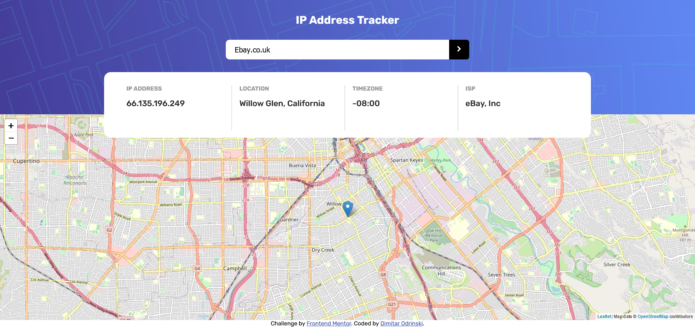
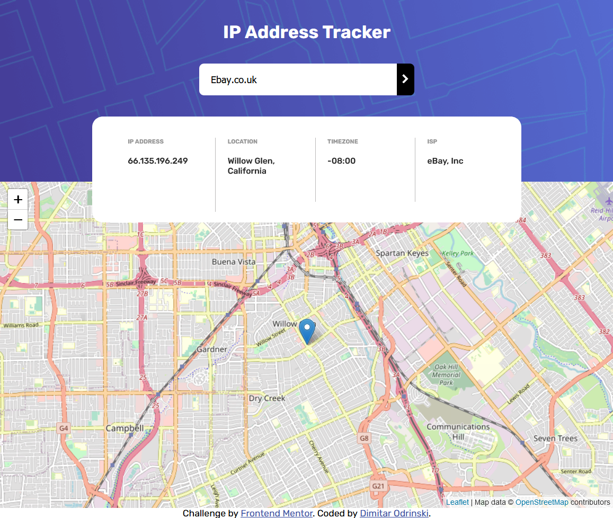
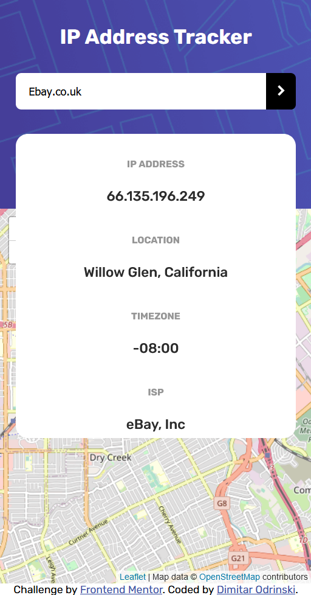

# Frontend Mentor - IP Address Tracker

## The challenge

Your challenge is to build out this IP Address Tracker app and get it looking as close to the design as possible. To get the IP Address locations, you'll be using the [IP Geolocation API by IPify](https://geo.ipify.org/). To generate the map, we recommend using [LeafletJS](https://leafletjs.com/).

## My Solution 

Using pure HTML5 and CSS3, I have managed to match the oridinal with good proximity, having only .jpg files for scaling and preview. The webpage is fully responsive, achieved with media querries.
I used Leaflet.JS and Ipify, to fetch and display the data. The webpage module is fully functional.

Here are my results:

## Desktop view

Desktop view - 900px width.

## Mobile view

## Challenge specification

The design is to be created to the following widths:

- Mobile: 375px
- Desktop: 1440px
